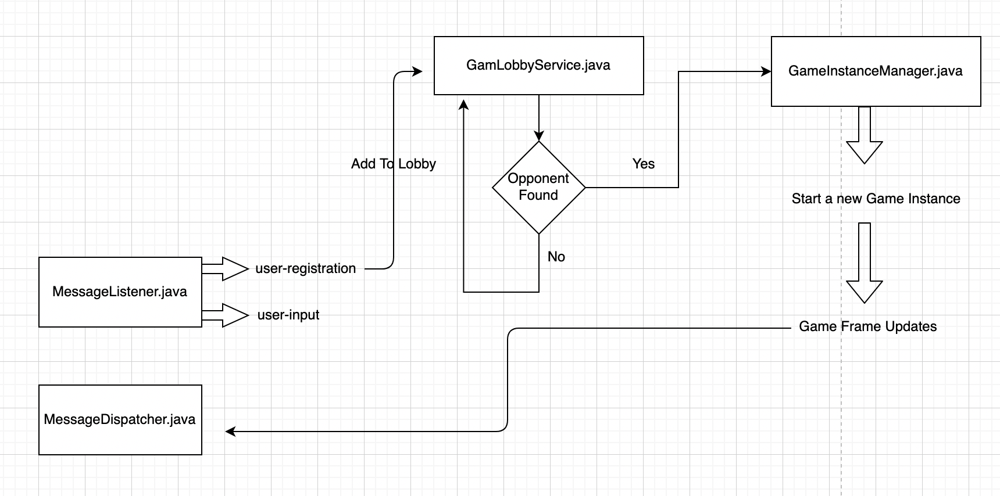

basic diagram of data flow to find the staring point, 
until the full blogpost is out.




Project Structure i followed:

```
src/main/java
└── com
    └── shrkyash
        └── shootership
            └── gamerunner
                ├── GamerunnerApplication.java
                ├── config
                │   └── GlobalConstants.java
                ├── model
                │   ├── MatchedPlayerGroup.java
                │   ├── User.java
                │   └── UserFrame.java
                ├── pubsub
                │   ├── FrameStreamPublisher.java
                │   ├── FrameStreamSource.java
                │   ├── MessageDispatcher.java
                │   ├── MessageListener.java
                │   ├── UserInputListener.java
                │   └── UserInputSink.java
                ├── repositories
                │   └── UserRepository.java
                ├── services
                │   ├── FrameDiff.java
                │   ├── GameInstance.java
                │   ├── GameInstanceManager.java
                │   └── GameLobbyService.java
                └── utils
                    └── TypeConverter.java

11 directories, 17 files
```
